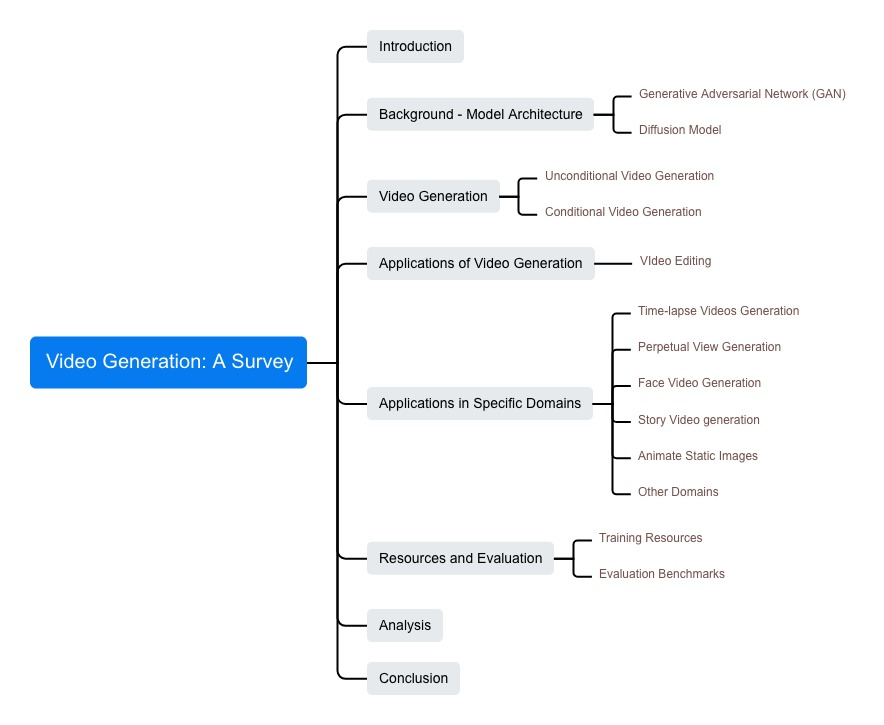

# Video Generation: A Survey

This repo is for the related resources referenced in the paper: [Video Generation: A Survey](https://arxiv.org/abs/2312.05603).

If you find this repository helpful, please cite the following:

```
cite
```

## News

* March 1, 2024 we released our paper in [arxiv](https://arxiv.org/abs/2312.05603).


## Links

- [Video Generation: A Survey](#video-generation-a-survey)
  - [News](#news)
  - [Links](#links)
  - [Overview](#overview)
  - [Model Architecture](#model-architecture)
    - [Generative Adversarial Network (GAN)](#generative-adversarial-network-gan)
    - [Diffusion Model](#diffusion-model)
  - [Video Generation](#video-generation)
    - [Unconditional Video Generation](#unconditional-video-generation)
    - [Conditional Video Generation](#conditional-video-generation)
  - [Application of Video Generation](#application-of-video-generation)
  - [Applications in Specific Domains](#applications-in-specific-domains)
  - [Resources and Evaluation](#resources-and-evaluation)
    - [Training Resources](#training-resources)
    - [Evaluation Benchmarks](#evaluation-benchmarks)
  - [References](#references)
  - [Contact](#contact)

## Overview
Video generation (VG) refers to the process of generating a sequence of frames based on textual descriptions, images, or other features. In this survey, we systematically review the literature on VG, covering the foundation techniques, accessible datasets, the training techniques, and applications on various fields and domains. Furthermore, we delve into the critical factors that impact the quality and effectiveness of generated videos, such as the resolution of the output video, the coherence of the generated content over time, and the ability to capture complex narratives or actions within videos. 
The survey also addresses the challenges and limitations currently faced in the VG field, points out existing pitfalls, and highlights the potential ethical and societal implications of video generation technology. Specifically, the typology of this survey is as follows:



## Model Architecture

### Generative Adversarial Network (GAN)

<table border=2>
    <tr>
        <td align="left"><b> Model </b> </td>
        <td align="center"><b> Paper </b> </td>
        <td align="center"><b> Code / Project </b> </td>
    </tr>
    <tr>
        <td align="center" colspan="9"><i> Generative Adversarial Network (GAN) </i></td> 
    </tr>
    <tr>
        <td>GAN [<a href="#ref1">1</a>]</td> 
        <td align="center"><a href="https://arxiv.org/pdf/1406.2661.pdf" target="_blank">paper</a></td>
        <td align="center"><a href="https://github.com/goodfeli/adversarial" target="_blank">code</a></td>
    </tr>
    <tr>
        <td>DCGAN [<a href="#ref2">2</a>]</td> 
        <td align="center"><a href="https://arxiv.org/pdf/1511.06434.pdf" target="_blank">paper</a></td>
        <td align="center"><a href="https://github.com/eriklindernoren/PyTorch-GAN/blob/master/implementations/dcgan/dcgan.py" target="_blank">pytorch-code</a></td>
    </tr>
</table>

### Diffusion Model

<table border=2>
    <tr>
        <td align="left"><b> Model </b> </td>
        <td align="center"><b> Paper </b> </td>
        <td align="center"><b> Code / Project </b> </td>
    </tr>
    <tr>
        <td align="center" colspan="9"><i> Denoising Diffusion Probabilistic Models (DDPMs) </i></td> 
    </tr>
    <tr>
        <td>DDPM [<a href="#ref3">3</a>]</td> 
        <td align="center"><a href="https://arxiv.org/pdf/2006.11239.pdf" target="_blank">paper</a></td>
        <td align="center"><a href="https://github.com/hojonathanho/diffusion" target="_blank">code</a></td>
    </tr>
    <tr>
        <td>Improved-DDPM [<a href="#ref4">4</a>]</td> 
        <td align="center"><a href="https://arxiv.org/pdf/2102.09672.pdf" target="_blank">paper</a></td>
        <td align="center"><a href="https://github.com/openai/improved-diffusion" target="_blank">code</a></td>
    </tr>
    <tr>
        <td>Nonequilibrium Thermodynamics [<a href="#ref5">5</a>]</td> 
        <td align="center"><a href="https://arxiv.org/pdf/1503.03585.pdf" target="_blank">paper</a></td>
        <td align="center"><a href="https://github.com/Sohl-Dickstein/Diffusion-Probabilistic-Models" target="_blank">code</a></td>
    </tr>
    <tr>
        <td align="center" colspan="9"><i> Score-Based Generative Models (SGMs)</i> </td> 
    </tr>
    <tr>
        <td> Noise Conditional Score Networks [<a href="#ref6">6</a>]</td> 
        <td align="center"><a href="https://arxiv.org/pdf/1907.05600v3.pdf" target="_blank">paper</a></td>
        <td align="center"><a href="https://github.com/ermongroup/ncsn" target="_blank">code</a></td>
    </tr>
    <tr>
        <td> Noise Conditional Score Networks Version 2 [<a href="#ref7">7</a>]</td> 
        <td align="center"><a href="https://arxiv.org/pdf/2006.09011v2.pdf" target="_blank">paper</a></td>
        <td align="center"><a href="https://github.com/ermongroup/ncsnv2" target="_blank">code</a></td>
    </tr>
    <tr>
        <td align="center" colspan="9"><i> Stochastic Differential Equations (Score SDEs) </i></td> 
    </tr>
    <tr>
        <td> Score-SDE [<a href="#ref8">8</a>]</td> 
        <td align="center"><a href="https://arxiv.org/pdf/2011.13456v2.pdf" target="_blank">paper</a></td>
        <td align="center"><a href="https://github.com/yang-song/score_sde" target="_blank">code</a></td>
    </tr>
</table>

## Video Generation

### Unconditional Video Generation
<table border=2>
    <tr>
        <td align="left"><b> Model </b> </td>
        <td align="center"><b> Paper </b> </td>
        <td align="center"><b> Code / Project </b> </td>
    </tr>
    <tr>
        <td align="center" colspan="9"><i> Unconditional Video Generation </i></td> 
    </tr>
    <tr>
        <td>VIDM [<a href="#ref9">9</a>]</td> 
        <td align="center"><a href="https://arxiv.org/pdf/2212.00235v1.pdf" target="_blank">paper</a></td>
        <td align="center"><a href="https://github.com/MKFMIKU/VIDM" target="_blank">code</a></td>
    </tr>
    <tr>
        <td>PosGN [<a href="#ref10">10</a>]</td> 
        <td align="center"><a href="https://arxiv.org/pdf/2102.09672v1.pdf" target="_blank">paper</a></td>
        <td align="center"><a href="https://github.com/openai/improved-diffusion" target="_blank">code</a></td>
    </tr>
    <tr>
        <td>LDM [<a href="#ref11">11</a>]</td> 
        <td align="center"><a href="https://arxiv.org/pdf/2112.10752v2.pdf" target="_blank">paper</a></td>
        <td align="center"><a href="https://github.com/compvis/stable-diffusion" target="_blank">code</a></td>
    </tr>
    <tr>
        <td>PVDM [<a href="#ref12">12</a>]</td> 
        <td align="center"><a href="https://arxiv.org/pdf/2302.07685v2.pdf" target="_blank">paper</a></td>
        <td align="center"><a href="https://github.com/sihyun-yu/pvdm" target="_blank">code</a></td>
    </tr>
    <tr>
        <td>GD-VDM [<a href="#ref13">13</a>]</td> 
        <td align="center"><a href="https://arxiv.org/pdf/2306.11173v1.pdf" target="_blank">paper</a></td>
        <td align="center"><a href="https://github.com/lapid92/gd-vdm" target="_blank">code</a></td>
    </tr>
    <tr>
        <td>LEO [<a href="#ref14">14</a>]</td> 
        <td align="center"><a href="https://arxiv.org/pdf/2305.03989v2.pdf" target="_blank">paper</a></td>
        <td align="center"><a href="https://github.com/wyhsirius/LEO" target="_blank">code</a></td>
    </tr>
    <tr>
        <td>VDT [<a href="#ref15">15</a>]</td> 
        <td align="center"><a href="https://arxiv.org/pdf/2305.13311v2.pdf" target="_blank">paper</a></td>
        <td align="center"><a href="https://github.com/rerv/vdt" target="_blank">code</a></td>
    </tr>
    <tr>
        <td>VIT [<a href="#ref16">16</a>]</td> 
        <td align="center"><a href="https://arxiv.org/pdf/2010.11929v2.pdf" target="_blank">paper</a></td>
        <td align="center"><a href="https://github.com/google-research/vision_transformer" target="_blank">code</a></td>
    </tr>
</table>

### Conditional Video Generation

<table border=2>
    <tr>
        <td align="left"><b> Model </b> </td>
        <td align="center"><b> Paper </b> </td>
        <td align="center"><b> Code / Project </b> </td>
    </tr>
    <tr>
        <td align="center" colspan="9"><i> Text-to-video Generation </i></td> 
    </tr>
    <tr>
        <td>GAN-based Text2Video [<a href="#ref17">17</a>]</td> 
        <td align="center"><a href="https://arxiv.org/pdf/1406.2661v1.pdf" target="_blank">paper</a></td>
        <td align="center"><a href="https://arxiv.org/pdf/1406.2661v1.pdf" target="_blank">code</a></td>
    </tr>
    <tr>
        <td>VQ-VAE [<a href="#ref18">18</a>]</td> 
        <td align="center"><a href="https://arxiv.org/pdf/1711.00937v2.pdf" target="_blank">paper</a></td>
        <td align="center"><a href="https://github.com/google-deepmind/sonnet/blob/v2/sonnet/src/nets/vqvae.py" target="_blank">code</a></td>
    </tr>
    <tr>
        <td>CogVideo [<a href="#ref19">19</a>]</td> 
        <td align="center"><a href="https://arxiv.org/pdf/2205.15868v1.pdf" target="_blank">paper</a></td>
        <td align="center"><a href="https://github.com/thudm/cogvideo" target="_blank">code</a></td>
    </tr>
    <tr>
        <td>GODIVA [<a href="#ref20">20</a>]</td> 
        <td align="center"><a href="https://arxiv.org/pdf/2104.14806v1.pdf" target="_blank">paper</a></td>
        <td align="center"><a href="https://github.com/mehdidc/DALLE_clip_score" target="_blank">code</a></td>
    </tr>
    <tr>
        <td>CogView2 [<a href="#ref21">21</a>]</td> 
        <td align="center"><a href="https://arxiv.org/pdf/2204.14217v2.pdf" target="_blank">paper</a></td>
        <td align="center"><a href="https://github.com/thudm/cogview2" target="_blank">code</a></td>
    </tr>
    <tr>
        <td>Swin Transformer [<a href="#ref22">2</a>]</td> 
        <td align="center"><a href="https://arxiv.org/pdf/2103.14030v2.pdf" target="_blank">paper</a></td>
        <td align="center"><a href="https://github.com/microsoft/Swin-Transformer" target="_blank">code</a></td>
    </tr>
    <tr>
        <td>PanoSwin [<a href="#ref23">23</a>]</td> 
        <td align="center"><a href="https://arxiv.org/pdf/2308.14726v1.pdf" target="_blank">paper</a></td>
        <td align="center">None</td>
    </tr>
    <tr>
        <td>Phenaki [<a href="#ref24">24</a>]</td> 
        <td align="center"><a href="https://arxiv.org/pdf/2210.02399v1.pdf" target="_blank">paper</a></td>
        <td align="center"><a href="https://github.com/lucidrains/phenaki-pytorch" target="_blank">code</a></td>
    </tr>
    <tr>
        <td>C-ViViT [<a href="#ref25">25</a>]</td> 
        <td align="center"><a href="https://arxiv.org/pdf/2103.15691v2.pdf" target="_blank">paper</a></td>
        <td align="center"><a href="https://github.com/google-research/scenic" target="_blank">code</a></td>
    </tr>
    <tr>
        <td>NUWA [<a href="#ref26">26</a>]</td> 
        <td align="center"><a href="https://arxiv.org/pdf/2111.12417v1.pdf" target="_blank">paper</a></td>
        <td align="center"><a href="https://github.com/lucidrains/nuwa-pytorch" target="_blank">code</a></td>
    </tr>
    <tr>
        <td>MMVG [<a href="#ref27">27</a>]</td> 
        <td align="center"><a href="https://arxiv.org/pdf/2211.12824v2.pdf" target="_blank">paper</a></td>
        <td align="center"><a href="https://github.com/tsujuifu/pytorch_tvc" target="_blank">code</a></td>
    </tr>
    <tr>
        <td align="center" colspan="9"><i> Training-based T2V Diffusion Methods </i></td> 
    </tr>
    <tr>
        <td>VDM [<a href="#ref28">28</a>]</td> 
        <td align="center"><a href="https://arxiv.org/pdf/2204.03458.pdf" target="_blank">paper</a></td>
        <td align="center"><a href="https://video-diffusion.github.io/" target="_blank">code</a></td>
    </tr>
    <tr>
        <td>Make-A-Video [<a href="#ref29">29</a>]</td> 
        <td align="center"><a href="https://arxiv.org/pdf/2209.14792v1.pdf" target="_blank">paper</a></td>
        <td align="center"><a href="https://github.com/lucidrains/make-a-video-pytorch" target="_blank">code</a></td>
    </tr>
    <tr>
        <td>MagicVideo [<a href="#ref30">30</a>]</td> 
        <td align="center"><a href="https://arxiv.org/pdf/2211.11018v2.pdf" target="_blank">paper</a></td>
        <td align="center">None</td>
    </tr>
    <tr>
        <td>LVDM [<a href="#ref31">31</a>]</td> 
        <td align="center"><a href="https://arxiv.org/pdf/2211.13221v2.pdf" target="_blank">paper</a></td>
        <td align="center"><a href="https://github.com/yingqinghe/lvdm" target="_blank">code</a></td>
    </tr>
    <tr>
        <td>ModelScope [<a href="#ref32">32</a>]</td> 
        <td align="center"><a href="https://arxiv.org/pdf/2308.06571v1.pdf" target="_blank">paper</a></td>
        <td align="center"><a href="https://github.com/exponentialml/text-to-video-finetuning" target="_blank">code</a></td>
    </tr>
    <tr>
        <td>Latent-Shift [<a href="#ref33">33</a>]</td> 
        <td align="center"><a href="https://arxiv.org/pdf/2304.08477v2.pdf" target="_blank">paper</a></td>
        <td align="center">None</td>
    </tr>
    <tr>
        <td align="center" colspan="9"><i> Multi-stage T2V Methods </i></td> 
    </tr>
    <tr>
        <td>Imagen Video [<a href="#ref34">34</a>]</td> 
        <td align="center"><a href="https://arxiv.org/pdf/2210.02303v1.pdf" target="_blank">paper</a></td>
        <td align="center"><a href="https://imagen.research.google/video/" target="_blank">project</a></td>
    </tr>
    <tr>
        <td>Video LDM [<a href="#ref35">35</a>]</td> 
        <td align="center"><a href="https://arxiv.org/pdf/2304.08818v2.pdf" target="_blank">paper</a></td>
        <td align="center"><a href="https://github.com/stability-ai/generative-models" target="_blank">code</a></td>
    </tr>
    <tr>
        <td>LaVie [<a href="#ref36">36</a>]</td> 
        <td align="center"><a href="https://arxiv.org/pdf/2309.15103v2.pdf" target="_blank">paper</a></td>
        <td align="center"><a href="https://github.com/Vchitect/LaVie" target="_blank">code</a></td>
    </tr>
    <tr>
        <td>Show-1 [<a href="#ref37">37</a>]</td> 
        <td align="center"><a href="https://arxiv.org/pdf/2309.15818v2.pdf" target="_blank">paper</a></td>
        <td align="center"><a href="https://github.com/showlab/show-1" target="_blank">code</a></td>
    </tr>
    <tr>
        <td>GPT-4 [<a href="#ref38">38</a>]</td> 
        <td align="center"><a href="https://arxiv.org/pdf/2303.08774v4.pdf" target="_blank">paper</a></td>
        <td align="center"><a href="https://github.com/openai/evals" target="_blank">project</a></td>
    </tr>
    <tr>
        <td align="center" colspan="9"><i> Audio-to-Video Generation </i></td> 
    </tr>
    <tr>
        <td>AADiff [<a href="#ref39">39</a>]</td> 
        <td align="center"><a href="https://arxiv.org/pdf/2305.04001v2.pdf" target="_blank">paper</a></td>
        <td align="center">None</td>
    </tr>
    <tr>
        <td>Generative Disco [<a href="#ref40">40</a>]</td> 
        <td align="center"><a href="https://arxiv.org/pdf/2304.08551v2.pdf" target="_blank">paper</a></td>
        <td align="center"><a href="https://github.com/hellovivian/generative-disco" target="_blank">code</a></td>
    </tr>
    <tr>
        <td>TPoS [<a href="#ref41">41</a>]</td> 
        <td align="center"><a href="https://arxiv.org/pdf/2309.04509v1.pdf" target="_blank">paper</a></td>
        <td align="center"><a href="https://ku-vai.github.io/TPoS/" target="_blank">code</a></td>
    </tr>
    <tr>
        <td align="center" colspan="9"><i> Imge-to-Video Generation </i></td> 
    </tr>
    <tr>
        <td>LaMD [<a href="#ref42">42</a>]</td> 
        <td align="center"><a href="https://arxiv.org/pdf/2304.11603v1.pdf" target="_blank">paper</a></td>
        <td align="center">None</td>
    </tr>
    <tr>
        <td>LFDM [<a href="#ref43">43</a>]</td> 
        <td align="center"><a href="https://arxiv.org/pdf/2303.13744v1.pdf" target="_blank">paper</a></td>
        <td align="center"><a href="https://github.com/nihaomiao/cvpr23_lfdm" target="_blank">code</a></td>
    </tr>
    <tr>
        <td>Generative Dynamics [<a href="#ref44">44</a>]</td> 
        <td align="center"><a href="https://arxiv.org/pdf/2309.07906.pdf" target="_blank">paper</a></td>
        <td align="center"><a href="https://generative-dynamics.github.io/" target="_blank">project</a></td>
    </tr>
    <tr>
        <td align="center" colspan="9"><i> Multimodal-to-video Generation </i></td> 
    </tr>
    <tr>
        <td>VideoComposer [<a href="#ref45">45</a>]</td> 
        <td align="center"><a href="https://arxiv.org/pdf/2306.02018v2.pdf" target="_blank">paper</a></td>
        <td align="center"><a href="https://videocomposer.github.io/" target="_blank">code</a></td>
    </tr>
    <tr>
        <td>MM-Diffusion [<a href="#ref46">46</a>]</td> 
        <td align="center"><a href="https://arxiv.org/pdf/2212.09478v2.pdf" target="_blank">paper</a></td>
        <td align="center"><a href="https://github.com/researchmm/MM-Diffusion" target="_blank">code</a></td>
    </tr>
    <tr>
        <td>MovieFactory [<a href="#ref47">47</a>]</td> 
        <td align="center"><a href="https://arxiv.org/pdf/2306.07257v1.pdf" target="_blank">paper</a></td>
        <td align="center">None</td>
    </tr>
    <tr>
        <td>CoDi [<a href="#ref48">48</a>]</td> 
        <td align="center"><a href="https://arxiv.org/pdf/2305.11846v1.pdf" target="_blank">paper</a></td>
        <td align="center"><a href="https://codi-gen.github.io/" target="_blank">code</a></td>
    </tr>
    <tr>
        <td>NExT-GPT [<a href="#ref49">49</a>]</td> 
        <td align="center"><a href="https://arxiv.org/pdf/2309.05519v2.pdf" target="_blank">paper</a></td>
        <td align="center"><a href="https://next-gpt.github.io/" target="_blank">code</a></td>
    </tr>
    <tr>
        <td align="center" colspan="9"><i> Feature-to-Video Generation </i></td> 
    </tr>
    <tr>
        <td>Follow Your Pose [<a href="#ref50">50</a>]</td> 
        <td align="center"><a href="https://arxiv.org/pdf/2304.01186v2.pdf" target="_blank">paper</a></td>
        <td align="center"><a href="https://follow-your-pose.github.io/" target="_blank">code</a></td>
    </tr>
    <tr>
        <td>Dreampose [<a href="#ref51">51</a>]</td> 
        <td align="center"><a href="https://arxiv.org/pdf/2304.06025v4.pdf" target="_blank">paper</a></td>
        <td align="center"><a href="https://grail.cs.washington.edu/projects/dreampose/" target="_blank">code</a></td>
    </tr>
    <tr>
        <td>Dancing Avatar [<a href="#ref52">52</a>]</td> 
        <td align="center"><a href="https://arxiv.org/pdf/2308.07749v1.pdf" target="_blank">paper</a></td>
        <td align="center">None</td>
    </tr>
    <tr>
        <td>DisCo [<a href="#ref53">53</a>]</td> 
        <td align="center"><a href="https://arxiv.org/pdf/2307.00040.pdf" target="_blank">paper</a></td>
        <td align="center"><a href="https://disco-dance.github.io/" target="_blank">code</a></td>
    </tr>
    <tr>
        <td>MCDiff [<a href="#ref54">54</a>]</td> 
        <td align="center"><a href="https://arxiv.org/pdf/2304.14404v1.pdf" target="_blank">paper</a></td>
        <td align="center"><a href="https://tsaishien-chen.github.io/MCDiff/" target="_blank">code</a></td>
    </tr>
    <tr>
        <td>DragNUWA [<a href="#ref55">55</a>]</td> 
        <td align="center"><a href="https://arxiv.org/pdf/2308.08089v1.pdf" target="_blank">paper</a></td>
        <td align="center"><a href="https://www.microsoft.com/en-us/research/project/dragnuwa/" target="_blank">code</a></td>
    </tr>
    <tr>
        <td>Make-Your-Video [<a href="#ref56">56</a>]</td> 
        <td align="center"><a href="https://arxiv.org/pdf/2306.00943v1.pdf" target="_blank">paper</a></td>
        <td align="center"><a href="https://doubiiu.github.io/projects/Make-Your-Video/" target="_blank">code</a></td>
    </tr>
    <tr>
        <td>Animate-A-Story [<a href="#ref57">57</a>]</td> 
        <td align="center"><a href="https://arxiv.org/pdf/2307.06940v1.pdf" target="_blank">paper</a></td>
        <td align="center"><a href="https://github.com/AILab-CVC/Animate-A-Story" target="_blank">code</a></td>
    </tr>
</table>

## Application of Video Generation

<table border=2>
    <tr>
        <td align="left"><b> Model </b> </td>
        <td align="center"><b> Paper </b> </td>
        <td align="center"><b> Code / Project </b> </td>
    </tr>
    <tr>
        <td align="center" colspan="9"><i> Video Editing </i></td> 
    </tr>
    <tr>
        <td>TokenFlow [<a href="#ref58">58</a>]</td> 
        <td align="center"><a href="https://arxiv.org/pdf/2307.10373v3.pdf" target="_blank">paper</a></td>
        <td align="center"><a href="https://diffusion-tokenflow.github.io/" target="_blank">code</a></td>
    </tr>
    <tr>
        <td>Talking-head Video Editing [<a href="#ref59">59</a>]</td> 
        <td align="center"><a href="https://arxiv.org/pdf/1906.01524v1.pdf" target="_blank">paper</a></td>
        <td align="center"><a href="https://github.com/sibozhang/Text2Video" target="_blank">code</a></td>
    </tr>
    <tr>
        <td>NR-NeRF [<a href="#ref60">60</a>]</td> 
        <td align="center"><a href="https://arxiv.org/pdf/2012.12247v4.pdf" target="_blank">paper</a></td>
        <td align="center"><a href="https://github.com/facebookresearch/nonrigid_nerf" target="_blank">code</a></td>
    </tr>
    <tr>
        <td>Text2Live [<a href="#ref61">61</a>]</td> 
        <td align="center"><a href="https://arxiv.org/pdf/2204.02491v2.pdf" target="_blank">paper</a></td>
        <td align="center"><a href="https://github.com/omerbt/Text2LIVE" target="_blank">code</a></td>
    </tr>
    <tr>
        <td>HeadGAN [<a href="#ref62">62</a>]</td> 
        <td align="center"><a href="https://arxiv.org/pdf/2012.08261v3.pdf" target="_blank">paper</a></td>
        <td align="center"><a href="https://michaildoukas.github.io/HeadGAN/" target="_blank">code</a></td>
    </tr>
    <tr>
        <td>Dreamix [<a href="#ref63">63</a>]</td> 
        <td align="center"><a href="https://arxiv.org/pdf/2302.01329v1.pdf" target="_blank">paper</a></td>
        <td align="center"><a href="https://dreamix-video-editing.github.io/" target="_blank">code</a></td>
    </tr>
    <tr>
        <td>Video-P2P [<a href="#ref64">64</a>]</td> 
        <td align="center"><a href="https://arxiv.org/pdf/2303.04761v1.pdf" target="_blank">paper</a></td>
        <td align="center"><a href="https://video-p2p.github.io/" target="_blank">code</a></td>
    </tr>
    <tr>
        <td>Pix2Video [<a href="#ref65">65</a>]</td> 
        <td align="center"><a href="https://arxiv.org/pdf/2303.12688v1.pdf" target="_blank">paper</a></td>
        <td align="center"><a href="https://duyguceylan.github.io/pix2video.github.io/" target="_blank">code</a></td>
    </tr>
    <tr>
        <td>Edit-A-Video [<a href="#ref66">66</a>]</td> 
        <td align="center"><a href="https://arxiv.org/pdf/2303.07945v4.pdf" target="_blank">paper</a></td>
        <td align="center"><a href="https://editavideo.github.io/" target="_blank">code</a></td>
    </tr>
    <tr>
        <td>ControlVideo [<a href="#ref67">67</a>]</td> 
        <td align="center"><a href="https://arxiv.org/pdf/2305.17098v2.pdf" target="_blank">paper</a></td>
        <td align="center"><a href="https://github.com/thu-ml/controlvideo" target="_blank">code</a></td>
    </tr>
    <tr>
        <td>StableVideo [<a href="#ref68">68</a>]</td> 
        <td align="center"><a href="https://arxiv.org/pdf/2308.09592v1.pdf" target="_blank">paper</a></td>
        <td align="center"><a href="https://github.com/rese1f/StableVideo" target="_blank">code</a></td>
    </tr>
    <tr>
        <td>MagicEdit [<a href="#ref69">69</a>]</td> 
        <td align="center"><a href="https://arxiv.org/pdf/2308.14749v1.pdf" target="_blank">paper</a></td>
        <td align="center"><a href="https://magic-edit.github.io/" target="_blank">code</a></td>
    </tr>
    <tr>
        <td>In-N-Out [<a href="#ref70">70</a>]</td> 
        <td align="center"><a href="https://arxiv.org/pdf/2302.04871.pdf" target="_blank">paper</a></td>
        <td align="center"><a href="https://in-n-out-3d.github.io/" target="_blank">code</a></td>
    </tr>
    <tr>
        <td>Soundini [<a href="#ref71">71</a>]</td> 
        <td align="center"><a href="https://arxiv.org/pdf/2304.06818v1.pdf" target="_blank">paper</a></td>
        <td align="center"><a href="https://kuai-lab.github.io/soundini-gallery/" target="_blank">code</a></td>
    </tr>
</table>

## Applications in Specific Domains

<table border=2>
    <tr>
        <td align="left"><b> Model </b> </td>
        <td align="center"><b> Paper </b> </td>
        <td align="center"><b> Code / Project </b> </td>
    </tr>
    <tr>
        <td align="center" colspan="9"><i> Time-lapse Videos Generation </i></td> 
    </tr>
    <tr>
        <td>Time-Lapse Video Synthesis [<a href="#ref72">72</a>]</td> 
        <td align="center"><a href="https://arxiv.org/pdf/1904.00680v1.pdf" target="_blank">paper</a></td>
        <td align="center">None</td>
    </tr>
    <tr>
        <td align="center" colspan="9"><i> Perpetual View Generation </i></td> 
    </tr>
    <tr>
        <td>Infinite Nature [<a href="#ref73">73</a>]</td> 
        <td align="center"><a href="https://arxiv.org/pdf/2012.09855v4.pdf" target="_blank">paper</a></td>
        <td align="center"><a href="https://infinite-nature.github.io/" target="_blank">code</a></td>
    </tr>
    <tr>
        <td>InfiniteNature-Zero [<a href="#ref74">74</a>]</td> 
        <td align="center"><a href="https://arxiv.org/pdf/2207.11148v1.pdf" target="_blank">paper</a></td>
        <td align="center"><a href="https://infinite-nature-zero.github.io/" target="_blank">code</a></td>
    </tr>
    <tr>
        <td align="center" colspan="9"><i> Face Video Generation </i></td> 
    </tr>
    <tr>
        <td>StyleFaceV [<a href="#ref75">75</a>]</td> 
        <td align="center"><a href="https://arxiv.org/pdf/2208.07862v1.pdf" target="_blank">paper</a></td>
        <td align="center"><a href="https://github.com/arthur-qiu/stylefacev" target="_blank">code</a></td>
    </tr>
    <tr>
        <td>Face2Vid [<a href="#ref76">76</a>]</td> 
        <td align="center"><a href="https://ieeexplore.ieee.org/document/8995571" target="_blank">paper</a></td>
        <td align="center">None</td>
    </tr>
    <tr>
        <td>GAN-based Video Synthesis [<a href="#ref77">77</a>]</td> 
        <td align="center"><a href="https://arxiv.org/pdf/2008.02793v2.pdf" target="_blank">paper</a></td>
        <td align="center">None</td>
    </tr>
    <tr>
        <td>PV3D [<a href="#ref78">78</a>]</td> 
        <td align="center"><a href="https://arxiv.org/pdf/2212.06384v3.pdf" target="_blank">paper</a></td>
        <td align="center"><a href="https://showlab.github.io/pv3d/" target="_blank">code</a></td>
    </tr>
    <tr>
        <td align="center" colspan="9"><i> Story Video Generation </i></td> 
    </tr>
    <tr>
        <td>Animate-A-Story [<a href="#ref57">57</a>]</td> 
        <td align="center"><a href="https://arxiv.org/pdf/2307.06940v1.pdf" target="_blank">paper</a></td>
        <td align="center"><a href="https://github.com/AILab-CVC/Animate-A-Story" target="_blank">code</a></td>
    </tr>
    <tr>
        <td align="center" colspan="9"><i> Animate Static Images </i></td> 
    </tr>
    <tr>
        <td>AnimateDiff [<a href="#ref79">79</a>]</td> 
        <td align="center"><a href="https://arxiv.org/pdf/2307.04725v2.pdf" target="_blank">paper</a></td>
        <td align="center"><a href="https://github.com/guoyww/AnimateDiff" target="_blank">code</a></td>
    </tr>
</table>

## Resources and Evaluation

### Training Resources

<table border=2>
    <tr>
        <td align="left"><b> Model </b> </td>
        <td align="center"><b> Paper </b> </td>
        <td align="center"><b> Datasets Page </b> </td>
        <td align="center"><b> Domain </b> </td>
        <td align="center"><b> # Instance </b> </td>
    </tr>
    <tr>
        <td>YT-BB [<a href="#ref80">80</a>]</td> 
        <td align="center"><a href="https://arxiv.org/pdf/1702.00824v5.pdf" target="_blank">paper</a></td>
        <td align="center"><a href="https://research.google.com/youtube-bb/" target="_blank">link</a></td>
        <td align="center">Object Detection</td>
        <td align="center">380K Video Segments </td>
    </tr>
    <tr>
        <td>Kinetics [<a href="#ref81">81</a>]</td> 
        <td align="center"><a href="https://arxiv.org/pdf/1705.06950v1.pdf" target="_blank">paper</a></td>
        <td align="center"><a href="https://deepmind.google/" target="_blank">link</a></td>
        <td align="center">Human Action</td>
        <td align="center">306K Videos </td>
    </tr>
    <tr>
        <td>FaceForensics [<a href="#ref82">82</a>]</td> 
        <td align="center"><a href="https://arxiv.org/pdf/1803.09179v1.pdf" target="_blank">paper</a></td>
        <td align="center"><a href="https://github.com/ondyari/FaceForensics" target="_blank">link</a></td>
        <td align="center">The Detection of Face Manipulations</td>
        <td align="center">500K Face Images </td>
    </tr>
    <tr>
        <td>Sky Time-lapse Dataset [<a href="#ref83">83</a>]</td> 
        <td align="center"><a href="https://arxiv.org/pdf/1709.07592v3.pdf" target="_blank">paper</a></td>
        <td align="center"><a href="https://github.com/weixiong-ur/mdgan" target="_blank">link</a></td>
        <td align="center">Time-lapse Tasks</td>
        <td align="center">35K YouTube Video Clips </td>
    </tr>
    <tr>
        <td>HowTo100M [<a href="#ref84">84</a>]</td> 
        <td align="center"><a href="https://arxiv.org/pdf/1906.03327v2.pdf" target="_blank">paper</a></td>
        <td align="center"><a href="https://www.di.ens.fr/willow/research/howto100m/" target="_blank">link</a></td>
        <td align="center">Text-video Tasks</td>
        <td align="center">136M Text-video Pairs </td>
    </tr>
    <tr>
        <td>WebVid-10M [<a href="#ref85">85</a>]</td> 
        <td align="center"><a href="https://arxiv.org/pdf/2104.00650v2.pdf" target="_blank">paper</a></td>
        <td align="center"><a href="https://github.com/m-bain/frozen-in-time" target="_blank">link</a></td>
        <td align="center">Text-video Tasks</td>
        <td align="center">10.7M Text-video Pairs </td>
    </tr>
    <tr>
        <td>HD-VILA-100M [<a href="#ref86">86</a>]</td> 
        <td align="center"><a href="https://arxiv.org/pdf/2111.10337v2.pdf" target="_blank">paper</a></td>
        <td align="center"><a href="https://github.com/microsoft/xpretrain" target="_blank">link</a></td>
        <td align="center">Text-video Tasks</td>
        <td align="center">103M Text-video Pairs </td>
    </tr>
    <tr>
        <td>CelebV-HQ [<a href="#ref87">87</a>]</td> 
        <td align="center"><a href="https://arxiv.org/pdf/2207.12393v1.pdf" target="_blank">paper</a></td>
        <td align="center"><a href="https://celebv-hq.github.io/" target="_blank">link</a></td>
        <td align="center">Face Generation / Face Editing</td>
        <td align="center">35K Video Clips </td>
    </tr>
    <tr>
        <td>Youku-mPLUG [<a href="#ref88">88</a>]</td> 
        <td align="center"><a href="https://arxiv.org/pdf/2306.04362v1.pdf" target="_blank">paper</a></td>
        <td align="center"><a href="https://github.com/x-plug/youku-mplug" target="_blank">link</a></td>
        <td align="center">Text-video Tasks</td>
        <td align="center">10M Chinese Text-video Pairs </td>
    </tr>
    <tr>
        <td>HD-VG-130M [<a href="#ref89">89</a>]</td> 
        <td align="center"><a href="https://arxiv.org/pdf/2305.10874v2.pdf" target="_blank">paper</a></td>
        <td align="center"><a href="https://github.com/daooshee/HD-VG-130M" target="_blank">link</a></td>
        <td align="center">Text-video Tasks</td>
        <td align="center">10M Text-video Pairs </td>
    </tr>
    <tr>
        <td>Vimeo25M [<a href="#ref36">36</a>]</td> 
        <td align="center"><a href="https://arxiv.org/pdf/2309.15103v2.pdf" target="_blank">paper</a></td>
        <td align="center"><a href="https://github.com/Vchitect/LaVie" target="_blank">link</a></td>
        <td align="center">Text-video Tasks</td>
        <td align="center">25M Text-video Pairs </td>
    </tr>
    <tr>
        <td>InternVid [<a href="#ref90">90</a>]</td> 
        <td align="center"><a href="https://arxiv.org/pdf/2307.06942v2.pdf" target="_blank">paper</a></td>
        <td align="center"><a href="https://github.com/OpenGVLab/InternVideo/tree/main/Data/InternVid" target="_blank">link</a></td>
        <td align="center">Text-video Tasks</td>
        <td align="center">234M Text-video Pairs </td>
    </tr>
</table>

### Evaluation Benchmarks

<table border=2>
    <tr>
        <td align="left"><b> Model </b> </td>
        <td align="center"><b> Paper </b> </td>
        <td align="center"><b> Datasets Page </b> </td>
        <td align="center"><b> Domain </b> </td>
        <td align="center"><b> # Instance </b> </td>
    </tr>
    <tr>
        <td>UCF-101 [<a href="#ref91">91</a>]</td> 
        <td align="center"><a href="https://arxiv.org/pdf/1212.0402v1.pdf" target="_blank">paper</a></td>
        <td align="center"><a href="https://www.crcv.ucf.edu/data/UCF101.php" target="_blank">link</a></td>
        <td align="center">Action Recognition</td>
        <td align="center">13K YouTube Video Clips </td>
    </tr>
    <tr>
        <td>Human3.6M [<a href="#ref92">92</a>]</td> 
        <td align="center"><a href="https://ieeexplore.ieee.org/document/6682899" target="_blank">paper</a></td>
        <td align="center"><a href="http://vision.imar.ro/human3.6m/description.php" target="_blank">link</a></td>
        <td align="center">Human Motion Generation</td>
        <td align="center">3.6M Cccurate 3D Human Motions </td>
    </tr>
    <tr>
        <td>TGIF [<a href="#ref93">93</a>]</td> 
        <td align="center"><a href="https://arxiv.org/pdf/1604.02748v2.pdf" target="_blank">paper</a></td>
        <td align="center"><a href="https://github.com/raingo/TGIF-Release" target="_blank">link</a></td>
        <td align="center">GIFs Generation</td>
        <td align="center">10K Tumblr GIF-Annotation Pairs </td>
    </tr>
    <tr>
        <td>BAIR Robot [<a href="#ref94">94</a>]</td> 
        <td align="center"><a href="https://arxiv.org/pdf/1710.05268v1.pdf" target="_blank">paper</a></td>
        <td align="center"><a href="https://sites.google.com/berkeley.edu/robotic-interaction-datasets" target="_blank">link</a></td>
        <td align="center">Stochastic Video Generation</td>
        <td align="center">45K Trajectory Videos </td>
    </tr>
    <tr>
        <td>SM-MNIST [<a href="#ref95">95</a>]</td> 
        <td align="center"><a href="https://arxiv.org/pdf/1802.07687v2.pdf" target="_blank">paper</a></td>
        <td align="center"><a href="https://github.com/edenton/svg" target="_blank">link</a></td>
        <td align="center">Stochastic Video Generation</td>
        <td align="center">60K 64x64 Moving Digits </td>
    </tr>
</table>

## References 

### Model Architecture
<a id="ref1">[1]</a> GANIan Goodfellow, Jean Pouget-Abadie, Mehdi Mirza, Bing Xu, DavidWarde-Farley, Sherjil Ozair, Aaron Courville, and Yoshua Bengio. 2020 **Generative adversarial networks.** Communications of the ACM. [<u>Paper</u>](https://arxiv.org/pdf/1406.2661.pdf)

<a id="ref2">[2]</a> Alec Radford, Luke Metz, and Soumith Chintala. 2015. **Unsupervised representation learning with deep convolutional generative adversarial networks.** arXiv preprint arXiv:1511.06434. [<u>Paper</u>](https://arxiv.org/pdf/1511.06434.pdf)

<a id="ref3">[3]</a> Jonathan Ho, Ajay Jain, and Pieter Abbeel. 2020. **Denoising diffusion probabilistic models.** Advances in neural information processing systems, 33:6840– 6851. [<u>Paper</u>](https://arxiv.org/pdf/2006.11239.pdf)

<a id="ref4">[4]</a> Alexander Quinn Nichol and Prafulla Dhariwal. 2021. **Improved denoising diffusion probabilistic models.** In ICML.
 [<u>Paper</u>](https://arxiv.org/pdf/2102.09672.pdf)

<a id="ref5">[5]</a> Jascha Sohl-Dickstein, Eric Weiss, Niru Maheswaranathan, and Surya Ganguli. 2015. **Deep unsupervised learning using nonequilibrium thermodynamics.** In ICML.
 [<u>Paper</u>](https://arxiv.org/pdf/1503.03585.pdf)

<a id="ref6">[6]</a> Yang Song and Stefano Ermon. 2019. **Generative modeling by estimating gradients of the data distribution.** Advances in neural information processing systems, 32.
 [<u>Paper</u>](https://arxiv.org/pdf/1907.05600v3.pdf)

<a id="ref7">[7]</a> Yang Song and Stefano Ermon. 2020.
**Improved techniques for training score-based generative models.** In NeurIPS.
 [<u>Paper</u>](https://arxiv.org/pdf/2006.09011v2.pdf)

<a id="ref8">[8]</a> Yang Song, Jascha Sohl-Dickstein, Diederik P Kingma, Abhishek Kumar, Stefano Ermon, and Ben Poole. 2021b. **Score-based generative modeling through stochastic differential equations.** In ICLR.
 [<u>Paper</u>](https://arxiv.org/pdf/2011.13456v2.pdf)

### Video Generation

<a id="ref9">[9]</a> Kangfu Mei and Vishal Patel. 2023. **Vidm: Video implicit diffusion models.** In AAAI.
 [<u>Paper</u>](https://arxiv.org/pdf/2212.00235v1.pdf)

<a id="ref10">[10]</a> Alexander Quinn Nichol and Prafulla Dhariwal. 2021. **Improved denoising diffusion probabilistic models.** In ICML.
 [<u>Paper</u>](https://arxiv.org/pdf/2102.09672v1.pdf)

<a id="ref11">[11]</a> Robin Rombach, Andreas Blattmann, Dominik Lorenz, Patrick Esser, and Björn Ommer. 2022a. **High-resolution image synthesis with latent diffusion models.** In CVPR. [<u>Paper</u>](https://arxiv.org/pdf/2112.10752v2.pdf)

<a id="ref12">[12]</a> Sihyun Yu, Kihyuk Sohn, Subin Kim, and Jinwoo Shin. 2023. **Video probabilistic diffusion models in projected latent space.** In CVPR. [<u>Paper</u>](https://arxiv.org/pdf/2302.07685v2.pdf)

<a id="ref13">[13]</a> Ariel Lapid, Idan Achituve, Lior Bracha, and Ethan Fetaya. 2023. **Gd-vdm: Generated depth for better diffusion-based video generation.** arXiv:2306.11173. [<u>Paper</u>](https://arxiv.org/pdf/2306.11173v1.pdf)

<a id="ref14">[14]</a> Yaohui Wang, Xin Ma, Xinyuan Chen, Antitza Dantcheva, Bo Dai, and Yu Qiao. 2023g. **Leo: Generative latent image animator for human video synthesis.** arXiv:2305.03989. [<u>Paper</u>](https://arxiv.org/pdf/2305.03989v2.pdf)

<a id="ref15">[15]</a> Haoyu Lu, Guoxing Yang, Nanyi Fei, Yuqi Huo, Zhiwu Lu, Ping Luo, and Mingyu Ding. 2023. **Vdt: An empirical study on video diffusion with transformers.** arXiv:2305.13311. [<u>Paper</u>](https://arxiv.org/pdf/2305.13311v2.pdf)

<a id="ref16">[16]</a> Alexey Dosovitskiy, Lucas Beyer, Alexander Kolesnikov, Dirk Weissenborn, Xiaohua Zhai, Thomas Unterthiner, Mostafa Dehghani, Matthias Minderer, Georg Heigold, Sylvain Gelly, et al. 2021. **An image is worth 16x16 words: Transformers for image recognition at scale.** In ICLR. [<u>Paper</u>](https://arxiv.org/pdf/2010.11929v2.pdf)

<a id="ref17">[17]</a> Ian Goodfellow, Jean Pouget-Abadie, Mehdi Mirza, Bing Xu, David Warde-Farley, Sherjil Ozair, Aaron Courville, and Yoshua Bengio. 2020. **Generative adversarial networks.** Communications of the ACM. [<u>Paper</u>](https://arxiv.org/pdf/1406.2661v1.pdf)

<a id="ref18">[18]</a> Aaron Van Den Oord, Oriol Vinyals, et al. 2017. **Neural discrete representation learning.** NeurIPS. [<u>Paper</u>](https://arxiv.org/pdf/1711.00937v2.pdf)

<a id="ref19">[19]</a> Wenyi Hong, Ming Ding, Wendi Zheng, Xinghan Liu, and Jie Tang. 2022b. **Cogvideo: Large- scale pretraining for text-to-video generation via transformers.** arXiv preprint arXiv:2205.15868. [<u>Paper</u>](https://arxiv.org/pdf/2205.15868v1.pdf)

<a id="ref20">[20]</a> Chenfei Wu, Lun Huang, Qianxi Zhang, Binyang Li, Lei Ji, Fan Yang, Guillermo Sapiro, and Nan Duan. 2021. **Godiva: Generating open-domain videos from natural descriptions.** arXiv:2104.14806. [<u>Paper</u>](https://arxiv.org/pdf/2104.14806v1.pdf)

<a id="ref21">[21]</a> Ming Ding, Wendi Zheng, Wenyi Hong, and Jie Tang. 2022. **Cogview2: Faster and better text-to-image generation via hierarchical transformers.** In NeurIPS. [<u>Paper</u>](https://arxiv.org/pdf/2204.14217v2.pdf)

<a id="ref22">[22]</a> Ze Liu, Yutong Lin, Yue Cao, Han Hu, Yixuan Wei, Zheng Zhang, Stephen Lin, and Baining Guo. 2021c. **Swin transformer: Hierarchical vision transformer using shifted windows.** In ICCV. [<u>Paper</u>](https://arxiv.org/pdf/2103.14030v2.pdf)

<a id="ref23">[23]</a> Zhixin Ling, Zhen Xing, Xiangdong Zhou, Manliang Cao, and Guichun Zhou. 2023. **Panoswin: a pano-style swin transformer for panorama understanding.** In CVPR. [<u>Paper</u>](https://arxiv.org/pdf/2308.14726v1.pdf)

<a id="ref24">[24]</a> Ruben Villegas, Mohammad Babaeizadeh, Pieter- Jan Kindermans, Hernan Moraldo, Han Zhang, Mohammad Taghi Saffar, Santiago Castro, Julius Kunze, and Dumitru Erhan. 2022. **Phenaki: Variable length video generation from open domain textual description.** arXiv preprint arXiv:2210.02399. [<u>Paper</u>](https://arxiv.org/pdf/2210.02399v1.pdf)

<a id="ref25">[25]</a> Anurag Arnab, Mostafa Dehghani, Georg Heigold, Chen Sun, Mario Lucˇic ́, and Cordelia Schmid. 2021. **Vivit: A video vision transformer.** In ICCV. [<u>Paper</u>](https://arxiv.org/pdf/2103.15691v2.pdf)

<a id="ref26">[26]</a> Chenfei Wu, Jian Liang, Lei Ji, Fan Yang, Yuejian Fang, Daxin Jiang, and Nan Duan. 2022a. **Nüwa: Visual synthesis pre-training for neural visual world creation.** In ECCV. [<u>Paper</u>](https://arxiv.org/pdf/2111.12417v1.pdf)

<a id="ref27">[27]</a> Tsu-Jui Fu, Licheng Yu, Ning Zhang, Cheng-Yang Fu, Jong-Chyi Su, William Yang Wang, and Sean Bell. 2023. **Tell me what happened: Unifying text- guided video completion via multimodal masked video generation.** In CVPR. [<u>Paper</u>](https://arxiv.org/pdf/2211.12824v2.pdf)

<a id="ref28">[28]</a> Jonathan Ho, Tim Salimans, Alexey Gritsenko, William Chan, Mohammad Norouzi, and David J Fleet. 2022e. **Video diffusion models.** In NeurIPS. [<u>Paper</u>](https://arxiv.org/pdf/2204.03458.pdf)

<a id="ref29">[29]</a> Uriel Singer, Adam Polyak, Thomas Hayes, Xi Yin, Jie An, Songyang Zhang, Qiyuan Hu, Harry Yang, Oron Ashual, Oran Gafni, Devi Parikh, Sonal Gupta, and Yaniv Taigman. 2023. **Make-a-video: Text-to-video generation without text-video data.** In The Eleventh International Conference on Learning Representations. [<u>Paper</u>](https://arxiv.org/pdf/2209.14792v1.pdf)

<a id="ref30">[30]</a> Daquan Zhou, Weimin Wang, Hanshu Yan, Weiwei Lv, Yizhe Zhu, and Jiashi Feng. 2022a. **Magicvideo: Efficient video generation with latent diffusion models.** ArXiv, abs/2211.11018. [<u>Paper</u>](https://arxiv.org/pdf/2211.11018v2.pdf)

<a id="ref31">[31]</a> Yingqing He, Tianyu Yang, Yong Zhang, Ying Shan, and Qifeng Chen. 2022. **Latent video diffusion models for high-fidelity video generation with arbitrary lengths.** arXiv:2211.13221. [<u>Paper</u>](https://arxiv.org/pdf/2211.13221v2.pdf)

<a id="ref32">[32]</a> Jiuniu Wang, Hangjie Yuan, Dayou Chen, Yingya Zhang, Xiang Wang, and Shiwei Zhang. 2023a. **Modelscope text-to-video technical report.** arXiv:2308.06571. [<u>Paper</u>](https://arxiv.org/pdf/2308.06571v1.pdf)

<a id="ref33">[33]</a> Jie An, Songyang Zhang, Harry Yang, Sonal Gupta, Jia-Bin Huang, Jiebo Luo, and Xi Yin. 2023. **Latent-shift: Latent diffusion with temporal shift for efficient text-to-video generation.** arXiv:2304.08477. [<u>Paper</u>](https://arxiv.org/pdf/2304.08477v2.pdf)

<a id="ref34">[34]</a> Jonathan Ho, William Chan, Chitwan Saharia, Jay Whang, Ruiqi Gao, Alexey Gritsenko, Diederik P Kingma, Ben Poole, Mohammad Norouzi, David J Fleet, et al. 2022a. **Imagen video: High definition video generation with diffusion models.** arXiv:2210.02303. [<u>Paper</u>](https://arxiv.org/pdf/2210.02303v1.pdf)

<a id="ref35">[35]</a> Andreas Blattmann, Robin Rombach, Huan Ling, Tim Dockhorn, Seung Wook Kim, Sanja Fidler, and Karsten Kreis. 2023a. **Align your latents: High- resolution video synthesis with latent diffusion models.** In CVPR. [<u>Paper</u>](https://arxiv.org/pdf/2304.08818v2.pdf)

<a id="ref36">[36]</a> Yaohui Wang, Xinyuan Chen, Xin Ma, Shangchen Zhou, Ziqi Huang, Yi Wang, Ceyuan Yang, Yinan He, Jiashuo Yu, Peiqing Yang, et al. 2023e. **Lavie: High-quality video generation with cascaded latent diffusion models.** arXiv:2309.15103. [<u>Paper</u>](https://arxiv.org/pdf/2309.15103v2.pdf)

<a id="ref37">[37]</a> David Junhao Zhang, Jay Zhangjie Wu, Jia-Wei Liu, Rui Zhao, Lingmin Ran, Yuchao Gu, Difei Gao, and Mike Zheng Shou. 2023a. **Show-1: Marrying pixel and latent diffusion models for text-to-video generation.** arXiv:2309.15818. [<u>Paper</u>](https://arxiv.org/pdf/2309.15818v2.pdf)

<a id="ref38">[38]</a> OpenAI. 2023. **Gpt-4 technical report.** arXiv:2303.08774. [<u>Paper</u>](https://arxiv.org/pdf/2303.08774v4.pdf)

<a id="ref39">[39]</a> Seungwoo Lee, Chaerin Kong, Donghyeon Jeon, and Nojun Kwak. 2023b. **Aadiff: Audio-aligned video synthesis with text-to-image diffusion.** In CVPRW. [<u>Paper</u>](https://arxiv.org/pdf/2305.04001v2.pdf)

<a id="ref40">[40]</a> Vivian Liu, Tao Long, Nathan Raw, and Lydia Chilton. 2023b. **Generative disco: Text-to-video generation for music visualization.** arXiv:2304.08551. [<u>Paper</u>](https://arxiv.org/pdf/2304.08551v2.pdf)

<a id="ref41">[41]</a> Yujin Jeong, Wonjeong Ryoo, Seunghyun Lee, Dabin Seo, Wonmin Byeon, Sangpil Kim, and Jinkyu Kim. 2023. **The power of sound (tpos): Audio reactive video generation with stable diffusion.** In ICCV. [<u>Paper</u>](https://arxiv.org/pdf/2309.04509v1.pdf)

<a id="ref42">[42]</a> Yaosi Hu, Zhenzhong Chen, and Chong Luo. 2023. **Lamd: Latent motion diffusion for video generation.** arXiv:2304.11603. [<u>Paper</u>](https://arxiv.org/pdf/2304.11603v1.pdf)

<a id="ref43">[43]</a> Haomiao Ni, Changhao Shi, Kai Li, Sharon X Huang, and Martin Renqiang Min. 2023. **Conditional image- to-video generation with latent flow diffusion models.** In CVPR. [<u>Paper</u>](https://arxiv.org/pdf/2303.13744v1.pdf)

<a id="ref44">[44]</a> Zhengqi Li, Richard Tucker, Noah Snavely, and Aleksander Holynski. 2023c. **Generative image dynamics.** arXiv:2309.07906. [<u>Paper</u>](https://arxiv.org/pdf/2309.07906.pdf)

<a id="ref45">[45]</a> Xiang Wang, Hangjie Yuan, Shiwei Zhang, Dayou Chen, Jiuniu Wang, Yingya Zhang, Yujun Shen, Deli Zhao, and Jingren Zhou. 2023d. **Videocomposer: Compositional video synthesis with motion controllability.** arXiv:2306.02018. [<u>Paper</u>](https://arxiv.org/pdf/2306.02018v2.pdf)

<a id="ref46">[46]</a> Ludan Ruan, Yiyang Ma, Huan Yang, Huiguo He, Bei Liu, Jianlong Fu, Nicholas Jing Yuan, Qin Jin, and Baining Guo. 2023. **Mm-diffusion: Learning multi-modal diffusion models for joint audio and video generation.** In CVPR. [<u>Paper</u>](https://arxiv.org/pdf/2212.09478v2.pdf)

<a id="ref47">[47]</a> Junchen Zhu, Huan Yang, Huiguo He, Wenjing Wang, Zixi Tuo, Wen-Huang Cheng, Lianli Gao, Jingkuan Song, and Jianlong Fu. 2023. **Moviefactory: Automatic movie creation from text using large generative models for language and images.** arXiv:2306.07257. [<u>Paper</u>](https://arxiv.org/pdf/2306.07257v1.pdf)

<a id="ref48">[48]</a> Zineng Tang, Ziyi Yang, Chenguang Zhu, Michael Zeng, and Mohit Bansal. 2023. **Any-to-any generation via composable diffusion.** In NeurIPS. [<u>Paper</u>](https://arxiv.org/pdf/2305.11846v1.pdf)

<a id="ref49">[49]</a> Shengqiong Wu, Hao Fei, Leigang Qu, Wei Ji, and Tat- Seng Chua. 2023. **Next-gpt: Any-to-any multimodal llm.** arXiv:2309.05519. [<u>Paper</u>](https://arxiv.org/pdf/2309.05519v2.pdf)

<a id="ref50">[50]</a> Yue Ma, Yingqing He, Xiaodong Cun, Xintao Wang, Ying Shan, Xiu Li, and Qifeng Chen. 2023. **Follow your pose: Pose-guided text-to-video generation using pose-free videos.** arXiv:2304.01186. [<u>Paper</u>](https://arxiv.org/pdf/2304.01186v2.pdf)

<a id="ref51">[51]</a> Johanna Karras, Aleksander Holynski, Ting-Chun Wang, and Ira Kemelmacher-Shlizerman. 2023. **Dreampose: Fashion image-to-video synthesis via stable diffusion.** arXiv:2304.06025. [<u>Paper</u>](https://arxiv.org/pdf/2304.06025v4.pdf)

<a id="ref52">[52]</a> Bosheng Qin, Wentao Ye, Qifan Yu, Siliang Tang, and Yueting Zhuang. 2023. **Dancing avatar: Pose and text-guided human motion videos synthesis with image diffusion model.** arXiv:2308.07749. [<u>Paper</u>](https://arxiv.org/pdf/2308.07749v1.pdf)

<a id="ref53">[53]</a> Tan Wang, Linjie Li, Kevin Lin, Chung-Ching Lin, Zhengyuan Yang, Hanwang Zhang, Zicheng Liu, and Lijuan Wang. 2023b. **Disco: Disentangled control for referring human dance generation in real world.** arXiv:2307.00040. [<u>Paper</u>](https://arxiv.org/pdf/2307.00040.pdf)

<a id="ref54">[54]</a> Tsai-Shien Chen, Chieh Hubert Lin, Hung-Yu Tseng, Tsung-Yi Lin, and Ming-Hsuan Yang. 2023. **Motion-conditioned diffusion model for controllable video synthesis.** arXiv:2304.14404. [<u>Paper</u>](https://arxiv.org/pdf/2304.14404v1.pdf)

<a id="ref55">[55]</a> Shengming Yin, Chenfei Wu, Jian Liang, Jie Shi, Houqiang Li, Gong Ming, and Nan Duan. 2023. **Dragnuwa: Fine-grained control in video generation by integrating text, image, and trajectory.** arXiv:2308.08089. [<u>Paper</u>](https://arxiv.org/pdf/2308.08089v1.pdf)

<a id="ref56">[56]</a> Jinbo Xing, Menghan Xia, Yuxin Liu, Yuechen Zhang, Yong Zhang, Yingqing He, Hanyuan Liu, Haoxin Chen, Xiaodong Cun, Xintao Wang, et al. 2023a. **Make-your-video: Customized video generation using textual and structural guidance.** arXiv:2306.00943. [<u>Paper</u>](https://arxiv.org/pdf/2306.00943v1.pdf)

<a id="ref57">[57]</a> Yingqing He, Menghan Xia, Haoxin Chen, Xiaodong Cun, Yuan Gong, Jinbo Xing, Yong Zhang, Xintao Wang, Chao Weng, Ying Shan, et al. 2023a. **Animate- a-story: Storytelling with retrieval-augmented video generation.** arXiv:2307.06940. [<u>Paper</u>](https://arxiv.org/pdf/2307.06940v1.pdf)

### Application of Video Generation

<a id="ref58">[58]</a> Michal Geyer, Omer Bar-Tal, Shai Bagon, and Tali Dekel. 2023. **Tokenflow: Consistent diffusion features for consistent video editing.** arXiv:2307.10373. [<u>Paper</u>](https://arxiv.org/pdf/2307.10373v3.pdf)

<a id="ref59">[59]</a> Ohad Fried, Ayush Tewari, Michael Zollhöfer, Adam Finkelstein, Eli Shechtman, Dan B Goldman, Kyle Genova, Zeyu Jin, Christian Theobalt, and Maneesh Agrawala. 2019. **Text-based editing of talking- head video.** ACM Transactions on Graphics (TOG), 38(4):1–14. [<u>Paper</u>](https://arxiv.org/pdf/1906.01524v1.pdf)

<a id="ref60">[60]</a> Edgar Tretschk, Ayush Tewari, Vladislav Golyanik, Michael Zollhöfer, Christoph Lassner, and Christian Theobalt. 2021. **Non-rigid neural radiance fields: Reconstruction and novel view synthesis of a dynamic scene from monocular video.** In Proceedings of the IEEE/CVF International Conference on Computer Vision, pages 12959– 12970. [<u>Paper</u>](https://arxiv.org/pdf/2012.12247v4.pdf)

<a id="ref61">[61]</a> Omer Bar-Tal, Dolev Ofri-Amar, Rafail Fridman, Yoni Kasten, and Tali Dekel. 2022. Text2live: Text-driven layered image and video editing. In ECCV. [<u>Paper</u>](https://arxiv.org/pdf/2204.02491v2.pdf)

<a id="ref62">[62]</a> Michail Christos Doukas, Stefanos Zafeiriou, and Viktoriia Sharmanska. 2021. **Headgan: One-shot neural head synthesis and editing.** In Proceedings of the IEEE/CVF International conference on Computer Vision, pages 14398–14407. [<u>Paper</u>](https://arxiv.org/pdf/2012.08261v3.pdf)

<a id="ref63">[63]</a> Eyal Molad, Eliahu Horwitz, Dani Valevski, Alex Rav Acha, Yossi Matias, Yael Pritch, Yaniv Leviathan, and Yedid Hoshen. 2023. **Dreamix: Video diffusion models are general video editors.** arXiv preprint arXiv:2302.01329. [<u>Paper</u>](https://arxiv.org/pdf/2302.01329v1.pdf)

<a id="ref64">[64]</a> Shaoteng Liu, Yuechen Zhang, Wenbo Li, Zhe Lin, and Jiaya Jia. 2023a. **Video-p2p: Video editing with cross-attention control.** arXiv preprint arXiv:2303.04761. [<u>Paper</u>](https://arxiv.org/pdf/2303.04761v1.pdf)

<a id="ref65">[65]</a> Duygu Ceylan, Chun-Hao Paul Huang, and Niloy J Mitra. 2023. **Pix2video: Video editing using image diffusion.** In ICCV. [<u>Paper</u>](https://arxiv.org/pdf/2303.12688v1.pdf)

<a id="ref66">[66]</a> Chaehun Shin, Heeseung Kim, Che Hyun Lee, Sang-gil Lee, and Sungroh Yoon. 2023. **Edit-a-video: Single video editing with object-aware consistency.** arXiv preprint arXiv:2303.07945. [<u>Paper</u>](https://arxiv.org/pdf/2303.07945v4.pdf)

<a id="ref67">[67]</a> Min Zhao, Rongzhen Wang, Fan Bao, Chongxuan Li, and Jun Zhu. 2023. **Controlvideo: Adding conditional control for one shot text-to-video editing.** arXiv preprint arXiv:2305.17098. [<u>Paper</u>](https://arxiv.org/pdf/2305.17098v2.pdf)

<a id="ref68">[68]</a> Wenhao Chai, Xun Guo, Gaoang Wang, and Yan Lu. 2023. **Stablevideo: Text-driven consistency-aware diffusion video editing.** In ICCV. [<u>Paper</u>](https://arxiv.org/pdf/2308.09592v1.pdf)

<a id="ref69">[69]</a> Jun Hao Liew, Hanshu Yan, Jianfeng Zhang, Zhongcong Xu, and Jiashi Feng. 2023. **Magicedit: High-fidelity and temporally coherent video editing.** arXiv preprint arXiv:2308.14749. [<u>Paper</u>](https://arxiv.org/pdf/2308.14749v1.pdf)

<a id="ref70">[70]</a> Yiran Xu, Zhixin Shu, Cameron Smith, Jia-Bin Huang, and Seoung Wug Oh. 2023b. **In-n-out: Face video inversion and editing with volumetric decomposition.** arXiv preprint arXiv:2302.04871. [<u>Paper</u>](https://arxiv.org/pdf/2302.04871.pdf)

<a id="ref71">[71]</a> Seung Hyun Lee, Sieun Kim, Innfarn Yoo, Feng Yang, Donghyeon Cho, Youngseo Kim, Huiwen Chang, Jinkyu Kim, and Sangpil Kim. 2023a. Soundini: **Sound-guided diffusion for natural video editing.** arXiv:2304.06818. [<u>Paper</u>](https://arxiv.org/pdf/2304.06818v1.pdf)

### Applications in Specific Domains

<a id="ref72">[72]</a> Seonghyeon Nam, Chongyang Ma, Menglei Chai, William Brendel, Ning Xu, and Seon Joo Kim. 2019. **End-to-end time-lapse video synthesis from a single outdoor image.** In Proceedings of the IEEE/CVF Conference on Computer Vision and Pattern Recognition, pages 1409–1418. [<u>Paper</u>](https://arxiv.org/pdf/1904.00680v1.pdf)

<a id="ref73">[73]</a> Andrew Liu, Richard Tucker, Varun Jampani, Ameesh Makadia, Noah Snavely, and Angjoo Kanazawa. 2021a. **Infinite nature: Perpetual view generation of natural scenes from a single image.** In Proceedings of the IEEE/CVF International Conference on Computer Vision, pages 14458–14467. [<u>Paper</u>](https://arxiv.org/pdf/2012.09855v4.pdf)

<a id="ref74">[74]</a> Zhengqi Li, Qianqian Wang, Noah Snavely, and Angjoo Kanazawa. 2022. **Infinitenature-zero: Learning perpetual view generation of natural scenes from single images.** In European Conference on Computer Vision, pages 515–534. Springer. [<u>Paper</u>](https://arxiv.org/pdf/2207.11148v1.pdf)

<a id="ref75">[75]</a> Haonan Qiu, Yuming Jiang, Hang Zhou, Wayne Wu, and Ziwei Liu. 2022. **Stylefacev: Face video generation via decomposing and recomposing pretrained stylegan3.** arXiv preprint arXiv:2208.07862.
 [<u>Paper</u>](https://arxiv.org/pdf/2208.07862v1.pdf)

<a id="ref76">[76]</a> Lingyun Yu, Jun Yu, Mengyan Li, and Qiang Ling. 2020. **Multimodal inputs driven talking face generation with spatial–temporal dependency.** IEEE Transactions on Circuits and Systems for Video Technology, 31(1):203–216.
 [<u>Paper</u>](https://ieeexplore.ieee.org/document/8995571)

<a id="ref77">[77]</a> Ming-Yu Liu, Xun Huang, Jiahui Yu, Ting-Chun Wang, and Arun Mallya. 2021b. **Generative adversarial networks for image and video synthesis: Algorithms and applications.** Proceedings of the IEEE, 109(5):839–862.
 [<u>Paper</u>](https://arxiv.org/pdf/2008.02793v2.pdf)

<a id="ref78">[78]</a> Eric Zhongcong Xu, Jianfeng Zhang, Jun Hao Liew, Wenqing Zhang, Song Bai, Jiashi Feng, and Mike Zheng Shou. 2022. **Pv3d: A 3d generative model for portrait video generation.** arXiv preprint arXiv:2212.06384.
 [<u>Paper</u>](https://arxiv.org/pdf/2212.06384v3.pdf)

<a id="ref79">[79]</a> Yuwei Guo, Ceyuan Yang, Anyi Rao, Yaohui Wang, Yu Qiao, Dahua Lin, and Bo Dai. 2023. **Animatediff: Animate your personalized text-to-image diffusion models without specific tuning.** arXiv preprint arXiv:2307.04725.
 [<u>Paper</u>](https://arxiv.org/pdf/2307.04725v2.pdf)

### Resources and Evaluation

<a id="ref80">[80]</a> Esteban Real, Jonathon Shlens, Stefano Mazzocchi, Xin Pan, and Vincent Vanhoucke. 2017. **Youtube-boundingboxes: A large high-precision human- annotated data set for object detection in video.** In proceedings of the IEEE Conference on Computer Vision and Pattern Recognition, pages 5296–5305. [<u>Paper</u>](https://arxiv.org/pdf/1702.00824v5.pdf)

<a id="ref81">[81]</a> 
Will Kay, Joao Carreira, Karen Simonyan, Brian Zhang, Chloe Hillier, Sudheendra Vijayanarasimhan, Fabio Viola, Tim Green, Trevor Back, Paul Natsev, et al. 2017. **The kinetics human action video dataset.** arXiv preprint arXiv:1705.06950. [<u>Paper</u>](https://arxiv.org/pdf/1705.06950v1.pdf)

<a id="ref82">[82]</a> 
Andreas Rössler, Davide Cozzolino, Luisa Verdoliva, Christian Riess, Justus Thies, and Matthias Nießner. 2018. **Faceforensics: A large-scale video dataset for forgery detection in human faces.** arXiv preprint arXiv:1803.09179. [<u>Paper</u>](https://arxiv.org/pdf/1803.09179v1.pdf)

<a id="ref83">[83]</a> 
Wei Xiong, Wenhan Luo, Lin Ma, Wei Liu, and Jiebo Luo. 2018. **Learning to generate time-lapse videos using multi-stage dynamic generative adversarial networks.** In Proceedings of the IEEE Conference on Computer Vision and Pattern Recognition, pages 2364–2373. [<u>Paper</u>](https://arxiv.org/pdf/1709.07592v3.pdf)

<a id="ref84">[84]</a> 
Antoine Miech, Dimitri Zhukov, Jean-Baptiste Alayrac, Makarand Tapaswi, Ivan Laptev, and Josef Sivic. 2019a. **Howto100m: Learning a text-video embedding by watching hundred million narrated video clips.** In ICCV. [<u>Paper</u>](https://arxiv.org/pdf/1906.03327v2.pdf)

<a id="ref85">[85]</a> 
Max Bain, Arsha Nagrani, Gül Varol, and Andrew Zisserman. 2021a. **Frozen in time: A joint video and image encoder for end-to-end retrieval.** In ICCV. [<u>Paper</u>](https://arxiv.org/pdf/2104.00650v2.pdf)

<a id="ref86">[86]</a> 
Hongwei Xue, Tiankai Hang, Yanhong Zeng, Yuchong Sun, Bei Liu, Huan Yang, Jianlong Fu, and Baining Guo. 2022. **Advancing high-resolution video-language representation with large-scale video transcriptions.** In Proceedings of the IEEE/CVF Conference on Computer Vision and Pattern Recognition, pages 5036–5045. [<u>Paper</u>](https://arxiv.org/pdf/2111.10337v2.pdf)

<a id="ref87">[87]</a> 
Hao Zhu, Wayne Wu, Wentao Zhu, Liming Jiang, Siwei Tang, Li Zhang, Ziwei Liu, and Chen Change Loy. 2022. **Celebv-hq: A large-scale video facial attributes dataset.** In European conference on computer vision, pages 650–667. Springer. [<u>Paper</u>](https://arxiv.org/pdf/2207.12393v1.pdf)

<a id="ref88">[88]</a> 
Haiyang Xu, Qinghao Ye, Xuan Wu, Ming Yan, Yuan Miao, Jiabo Ye, Guohai Xu, Anwen Hu, Yaya Shi, Guangwei Xu, et al. 2023a. **Youku-mplug: A 10 million large-scale chinese video-language dataset for pre-training and benchmarks.** arXiv preprint arXiv:2306.04362. [<u>Paper</u>](https://arxiv.org/pdf/2306.04362v1.pdf)

<a id="ref89">[89]</a> 
Wenjing Wang, Huan Yang, Zixi Tuo, Huiguo He, Junchen Zhu, Jianlong Fu, and Jiaying Liu. 2023c. **Videofactory: Swap attention in spatiotemporal diffusions for text-to-video generation.** arXiv preprint arXiv:2305.10874. [<u>Paper</u>](https://arxiv.org/pdf/2305.10874v2.pdf)

<a id="ref90">[90]</a> 
Yi Wang, Yinan He, Yizhuo Li, Kunchang Li, Jiashuo Yu, Xin Ma, Xinyuan Chen, Yaohui Wang, Ping Luo, Ziwei Liu, et al. 2023h. **Internvid: A large-scale video-text dataset for multimodal understanding and generation.** arXiv:2307.06942. [<u>Paper</u>](https://arxiv.org/pdf/2307.06942v2.pdf)

<a id="ref91">[91]</a> 
Khurram Soomro, Amir Roshan Zamir, and Mubarak Shah. 2012. **Ucf101: A dataset of 101 human actions classes from videos in the wild.** arXiv preprint arXiv:1212.0402. [<u>Paper</u>](https://arxiv.org/pdf/1212.0402v1.pdf)

<a id="ref92">[92]</a> 
Catalin Ionescu, Dragos Papava, Vlad Olaru, and Cristian Sminchisescu. 2013. **Human3. 6m: Large scale datasets and predictive methods for 3d human sensing in natural environments.** IEEE transactions on pattern analysis and machine intelligence, 36(7):1325–1339. [<u>Paper</u>](https://ieeexplore.ieee.org/document/6682899)

<a id="ref93">[93]</a> 
Yuncheng Li, Yale Song, Liangliang Cao, Joel Tetreault, Larry Goldberg, Alejandro Jaimes, and Jiebo Luo. 2016. **TGIF: A New Dataset and Benchmark on Animated GIF Description.** In The IEEE Conference on Computer Vision and Pattern Recognition (CVPR). [<u>Paper</u>](https://arxiv.org/pdf/1604.02748v2.pdf)

<a id="ref94">[94]</a> 
Frederik Ebert, Chelsea Finn, Alex X Lee, and Sergey Levine. 2017. **Self-supervised visual planning with temporal skip connections.** CoRL, 12:16. [<u>Paper</u>](https://arxiv.org/pdf/1710.05268v1.pdf)

<a id="ref95">[95]</a> 
Emily Denton and Rob Fergus. 2018. **Stochastic video generation with a learned prior.** In ICML. [<u>Paper</u>](https://arxiv.org/pdf/1802.07687v2.pdf)


## Contact

If you have any issues or questions about this repo, feel free to contact: wangshuhe@stu.pku.edu.cn
